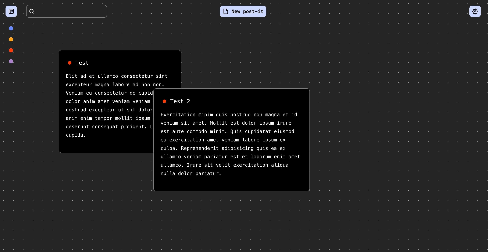

# It's Just Post-It

Just Post-It is a simple note-taking app aiming to provide a novel experience by allowing the user to just drop notes on a free canvas.

<p align="center">
  
</p>

## General notice

As this is a fork from a personal project presented [here](https://www.jeantinland.com/portfolio/draft-pad/) and detailed [in this blog post](https://www.jeantinland.com/blog/the-ultimate-note-app/), some basic features still need to be implemented before production use.

## Roadmap

Here are the planned features:

- Full description of all available features
- Add “Update available” indicator in settings' about tab
- Full i18n support (translations, reading direction, …)
- Keyboard shortcuts
- Global export of post-it
- Improve app responsive
- Make the app installable
- Demo website based on the real app
- …?

This list is non-exhaustive and expected to evolve.

## Dependencies & requirements

- npm
- node >= 18
- pm2

## Installation

Once you installed npm, node and pm2, follow these instructions.

```bash
# Clone this repo on your server in the desired location
git clone https://github.com/Jean-Tinland/just-post-it

# Go to the cloned folder
cd ./just-post-it

# Install dependencies
npm install

# This command will init the database
npm run init
```

## Configuration

```bash
# Duplicate the .env example
cp .env.example .env
```

Fill in the required information inside your .env:

```env
PROD_URL=https://your-production-url.com # the production url of your app
PORT=4000 # the port used by the app
JWT_SECRET=xxxxxxxx-xxxx-xxxx-xxxx-xxxxxxxxxxxx # the jwt secret, it can be anything like an UUID
JWT_DURATION=90 # the jwt token duration in days
PASSWORD=xxxxxxxx # your password
```

Just Post-It is now ready to run.

## Launching the app

Still in the `just-post-it` folder:

```bash
# This will start the app in the background with pm2
npm run launch
```

You can use either Apache or nginx to setup Just Post-It and make it accessible from the web.

> [!TIP]
> Once you launched `just-post-it`, pm2 will tell you that the process list is not saved. You can run `pm2 save` command in order to automaticaly restart all pm2 processes if your server is restarted.

## Updating the app

```bash
# This will stop the app, pull the latest changes and relaunch it
npm run update
```

> [!WARNING]
> Your Just Post-It app will be down during the update.
